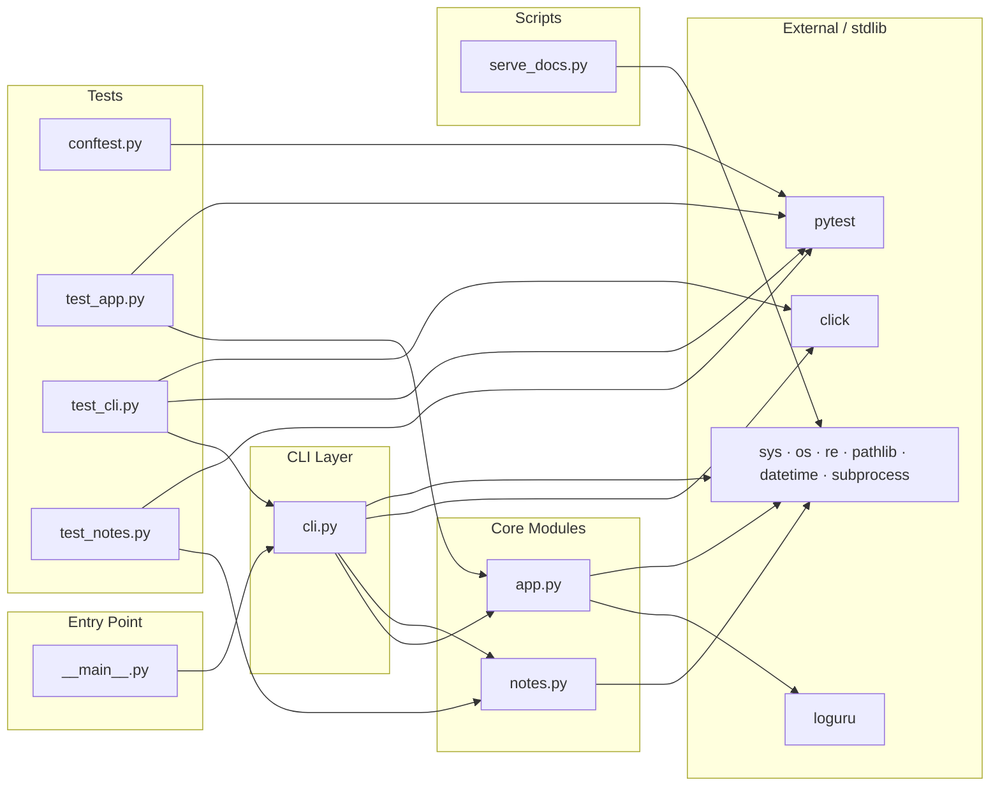

# Module Dependency Map

> **No circular dependencies detected.** All internal modules form a clean acyclic graph.

## Safe-change guide

| Module | Imports from | Imported by | Safe to change? |
|---|---|---|---|
| `app.py` | loguru, stdlib only | `cli.py`, `test_app.py` | Yes — leaf module, changes affect only its direct callers |
| `notes.py` | stdlib only | `cli.py`, `test_notes.py` | Yes — leaf module, same reasoning |
| `cli.py` | `app`, `notes`, click, stdlib | `__main__.py`, `test_cli.py` | Yes, but changes ripple to `__main__` and `test_cli` |
| `__main__.py` | `cli` only | *(entry point)* | Yes — nothing imports this |
| `conftest.py` | pytest only | *(pytest fixture scope)* | Yes — test infrastructure only |
| `serve_docs.py` | stdlib only | *(standalone script)* | Yes — fully isolated |

**Key insight:** `app.py` and `notes.py` are pure leaf modules with no internal imports.
Any refactor there stays local. The only module with fan-in risk is `cli.py`.
